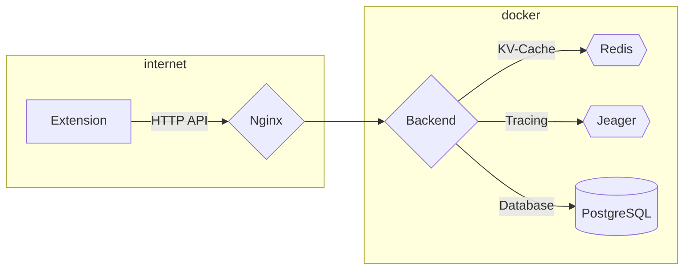

   

# Web of Web Trust backend

This is an experimental backend for the web of web trust browser extension. This project is intended to allow for a practical study of new technologies for this project *and* not as a production grade system.

## Architecture

